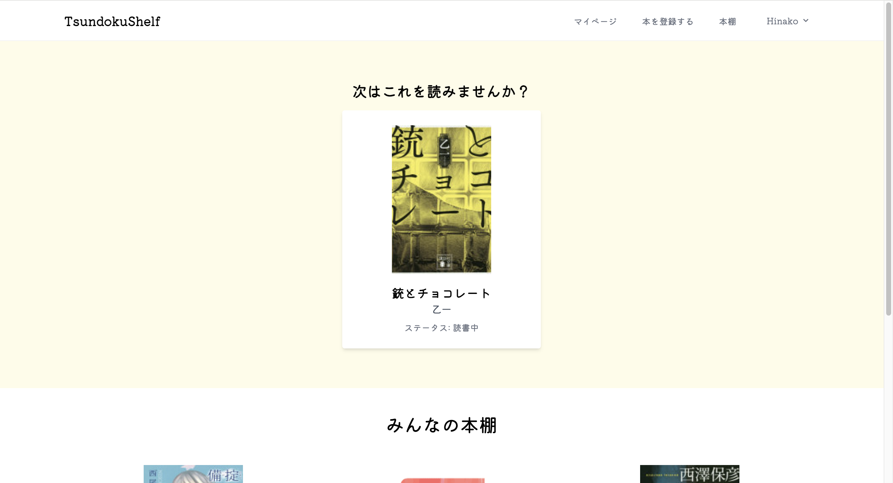
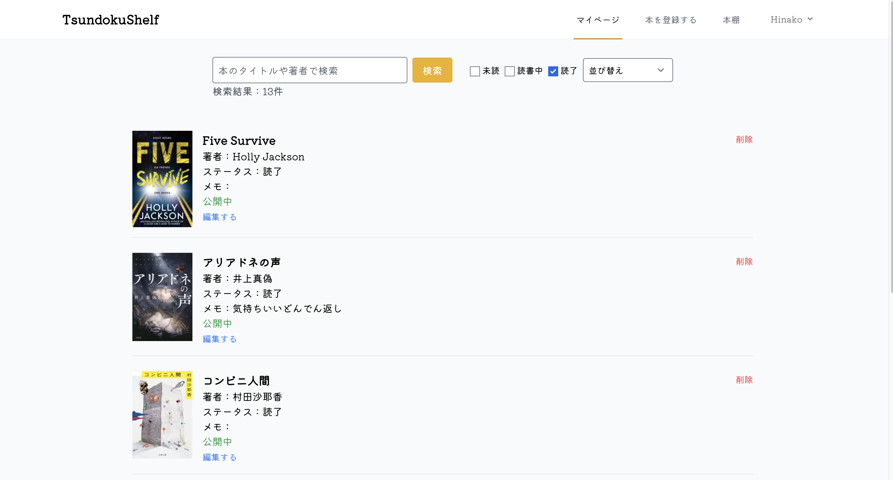
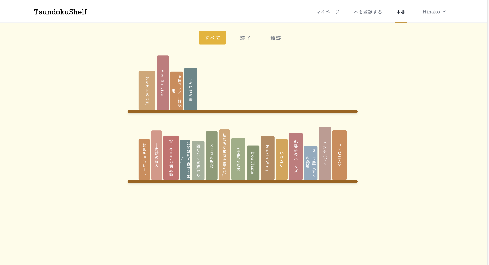

# Tsundokushelf

Tsundokushelf は「積読（つんどく）」本を管理するための Web アプリです。  
読んでいない本、読みかけの本、読了した本を分類・整理し、感想も書き残せます。

## デモサイト
https://hinakoya.com

## スクリーンショット
### 🏠 トップページ


### 👤 マイページ


### 📚 本棚ページ


## 🛠️ 主な機能
- ISBN から書籍情報を自動取得（Google Books API）して登録
- 積読・読書中・読了の分類と管理
- 読書完了日をカレンダーで記録
- 感想・レビューの投稿
- 本棚内検索・並び替え
- 本棚機能（積読本、読了本の数を可視化）


## ⚙️ 使用技術スタック
- Laravel 12
- MySQL
- Tailwind CSS
- Vite
- GitHub Actions
- Sakura VPS
- Let's Encrypt（SSL証明書）

## 🚀 セットアップ方法（ローカル開発環境用）

```bash
git clone https://github.com/H-inako/Tsundokushelf.git
cd Tsundokushelf
cp .env.example .env
composer install
npm install
php artisan key:generate
php artisan migrate
npm run dev
```
##今後の追加予定
レスポンシブ対応にする

##作者
Hinako Hamada
